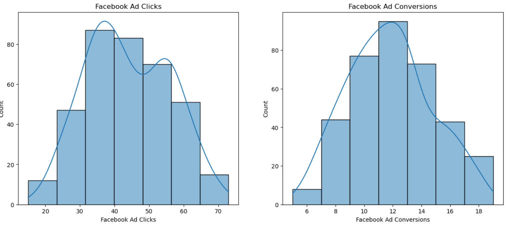

# Facebook vs AdWords — A/B Testing Analysis

A data-driven analysis of two advertising campaigns (Facebook & AdWords) to determine which platform delivers better ROI in terms of clicks, conversions, and cost-effectiveness.

---

## Business Problem

A marketing agency needs to decide where to allocate its advertising budget — **Facebook Ads** or **Google AdWords**. Using 365 days of campaign data from 2019, this project identifies the more effective platform through statistical analysis and machine learning.

> **Research Question:** Which ad platform is more effective in terms of conversions, clicks, and overall cost-effectiveness?

---

## Dataset

| Feature | Description |
|---|---|
| Date | Jan 1, 2019 – Dec 31, 2019 (365 rows) |
| Ad Views | Number of times the ad was seen |
| Ad Clicks | Number of clicks on the ad |
| Ad Conversions | Number of purchases/actions after clicking |
| Cost per Ad | Daily cost of running the campaign |
| CTR | Click-Through Rate = Clicks ÷ Views |
| Conversion Rate | Conversions ÷ Clicks |
| CPC | Cost Per Click = Ad Cost ÷ Clicks |

---

## Tech Stack


```
pandas · numpy · matplotlib · seaborn · scipy · sklearn · statsmodels
```

---

## Analysis Overview

### 1. Exploratory Data Analysis (EDA)

Distribution of Facebook Ad Clicks and Conversions — both show a roughly symmetrical shape with no major outliers.



---

### 2. Conversion Category Comparison

Facebook dominates in higher conversion ranges (10–15 and 15+), while AdWords stays stuck in the lower ranges (less than 6 and 6–10).


---

### 3. Correlation Analysis — Do clicks lead to conversions?

Facebook shows a strong upward trend (r = 0.87). AdWords is much more scattered (r = 0.45), meaning clicks don't reliably lead to conversions.


---

### 4. Linear Regression

Predicting Facebook conversions from clicks — the best fit line confirms a strong linear relationship (R² = 76.35%).


| Clicks | Expected Conversions |
|---|---|
| 50 | ~5.9 |
| 80 | ~8.8 |

---

### 5. Time-Series Analysis

**Weekly:** Monday and Tuesday consistently show the highest conversions.


**Monthly CPC:** May and November are the most cost-effective months. February is the most expensive.


---

## Hypothesis Testing (Welch's T-Test)

- **H0:** No difference in conversions between Facebook and AdWords
- **H1:** Facebook generates more conversions than AdWords

| Metric | Facebook | AdWords |
|---|---|---|
| Mean Conversions/day | 11.74 | 5.98 |
| T-Statistic | 32.88 | — |
| P-Value | 9.35e-134 | — |
| Result | **Reject H0** | — |

> Facebook delivers statistically significantly more conversions (p << 0.05)

---

## Key Findings

- Facebook generates **~2x more conversions** per day than AdWords
- Facebook clicks are a **strong predictor** of conversions (r = 0.87)
- The difference is **statistically significant** — not due to random chance
- **May & November** are the most cost-effective months to run Facebook Ads
- Ad spend and conversions have a **long-term equilibrium** relationship (Cointegration confirmed)

---

## Recommendation

> Allocate the majority of the advertising budget to **Facebook Ads**, particularly on **Mondays and Tuesdays** during **May and November** for maximum ROI.

---

## Project Structure

```
facebook-vs-adwords-ab-test/
│
├── facebook_vs_adwords_ab_analysis.ipynb   # Main analysis notebook
├── marketing_campaign.csv                  # Dataset
├── images/                                 # All plot screenshots
│   ├── histogram.png
│   ├── conversion_categories.png
│   ├── scatter_clicks_conversions.png
│   ├── regression.png
│   ├── weekly_conversions.png
│   └── monthly_cpc.png
├── README.md
└── LICENSE
```

---

## How to Run

```bash
# Clone the repo
git clone https://github.com/aditya-datahub/facebook-vs-adwords-ab-test.git

# Install dependencies
pip install pandas numpy matplotlib seaborn scipy scikit-learn statsmodels

# Open the notebook
jupyter notebook facebook_vs_adwords_ab_analysis.ipynb
```

---

## Connect

**Aditya Sharma** — [GitHub](https://github.com/aditya-datahub) · [LinkedIn](https://linkedin.com/in/)
